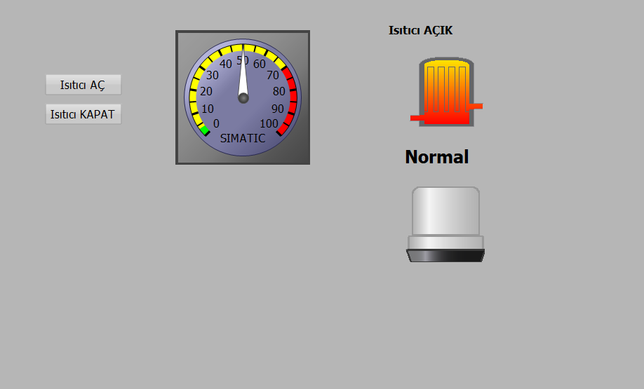
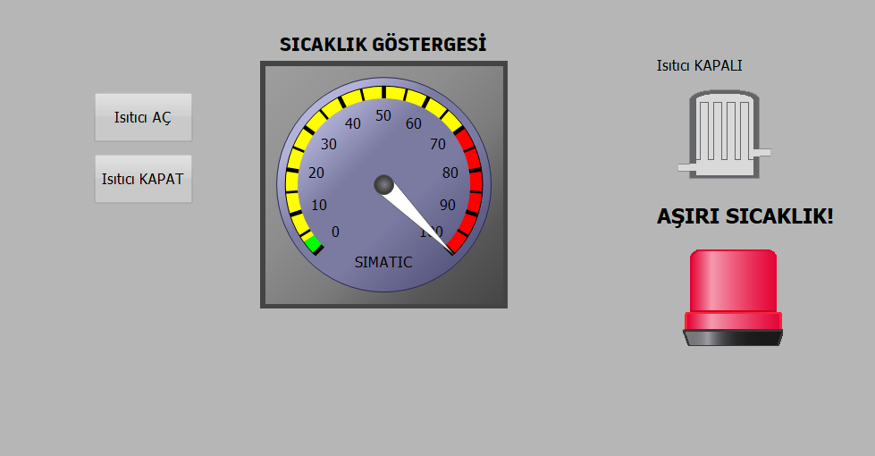

# Siemens WinCC SCADA – Sıcaklık Kontrollü Isıtıcı Paneli

Bu proje, Siemens TIA Portal & WinCC kullanılarak geliştirilmiş bir SCADA ekran tasarımıdır. Amaç, sıcaklık değerine göre sistem kontrolü ve görsel alarm oluşturmaktır.

## 🎯 Özellikler
- Analog gösterge ile sıcaklık takibi (0–100°C)
- Isıtıcı Aç/Kapat butonları
- Motor (ısıtıcı) simgesi ile duruma göre animasyon
- 75°C üzeri sıcaklıkta:
  - Motor otomatik olarak durur
  - Kırmızı ışıklı görsel alarm aktif olur (graphic list ile)
  
## 🖼️ Ekran Görüntüleri

### Normal Çalışma

### Alarm Durumu

## 🔧 Kullanılan Teknolojiler
- Siemens TIA Portal vXX
- WinCC Comfort
- PLCSIM (simülasyon için)

## 📁 Proje Yapısı
- WinCC ekran tasarımı
- Graphic list ile alarm görsel kontrolü
- Değere bağlı motor durdurma mantığı (logic içeride kuruludur)

## 🚀 Uygulama Alanı
- Isı kontrollü üretim prosesleri
- Gıda, ilaç ve kimya tesisleri için temel SCADA güvenlik arayüzü
- Freelance veya eğitim amaçlı sunumlar

## 👨‍💻 Geliştirici
Emre Canan Gök  
[Mekatronik Mühendisi]  
[(https://www.linkedin.com/in/emregok96/)]  
